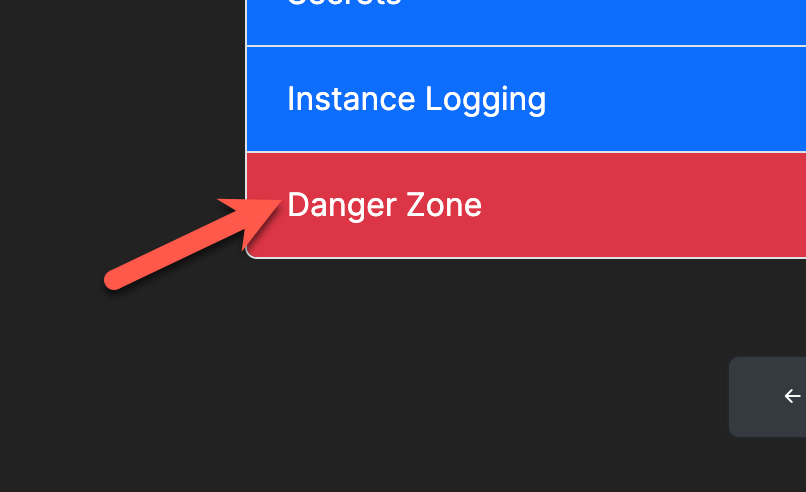

# Maintenance Mode

Maintenance Mode will cause your PocketBase instance to shut down. The `pocketbase` process will exit and no further requests will be processed.

Maintenance Mode is helpful for the following tasks:

- Updating the version \[./upgrading.md]\(see upgrading)
- Backing up your data \[./backup-and-restore.md]\(see backing up and restoring)
- Emergency shutdown for any other reason you choose.

## Entering Maintenance Mode

To activate Maintenance Mode, navigate to your instance dashboard and head for the Danger Zone.

<figure><figcaption>
Danger Zone
</figcaption></figure>

Then, switch the instance to Maintenance Mode.

<figure><figcaption>
Maintenance Mode
</figcaption></figure>

