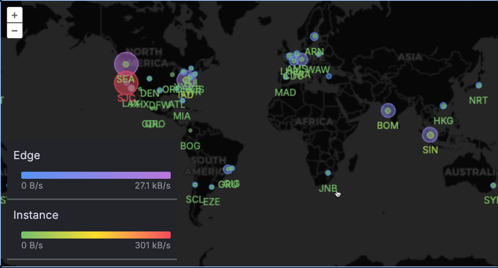
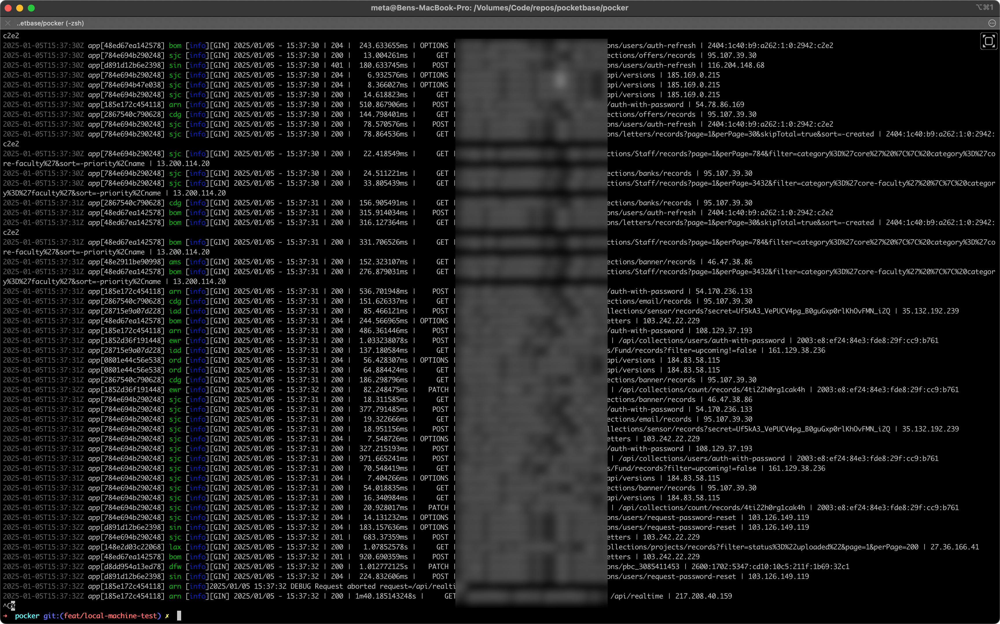

## PocketHost is live in 40+ countries

_[@cap'n](https://discord.gg/nVTxCMEcGT) Dec 25, 2024_

I've been hard at work getting PocketHost live in 40+ countries. This is the beginning of the 2025 global takeover by PocketHost.

We used to have just one prototype server running in SFO. Everyone would hit Cloudflare first, and Cloudflare would then proxy to SFO. This was okay, but users around the globe were reporting latency. After doing some research, I found that Fly's internal VPN routing was actually faster than Cloudflare's.

Now, we have PocketHost edges running around the globe. Your request hits the nearest PocketHost edge and is then routed via VPN to _another_ proxy server in SJC, which is milliseconds away from SFO. From there, the request is proxied over to SFO where our prototype server lives.

Below is a live log showing requests hitting PocketHost edges and then being routed to SJC where they are proxied over to SFO where our prototype server lives. The latency has been reduced by about 150ms on average. Processing the request still takes what it takes, but the latency of the request traveling back and forth between you and SFO is much lower.

This is part of the larger [Pocker](/blog/announcing-pocker) strategy.

