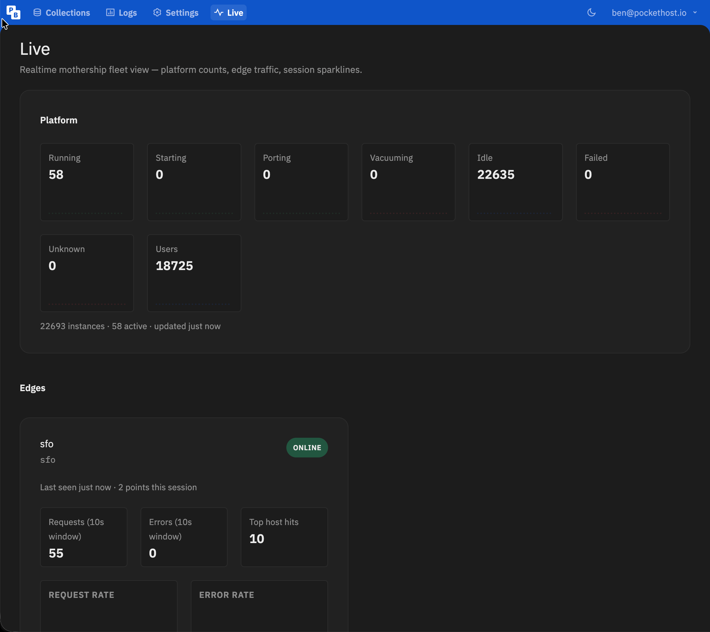
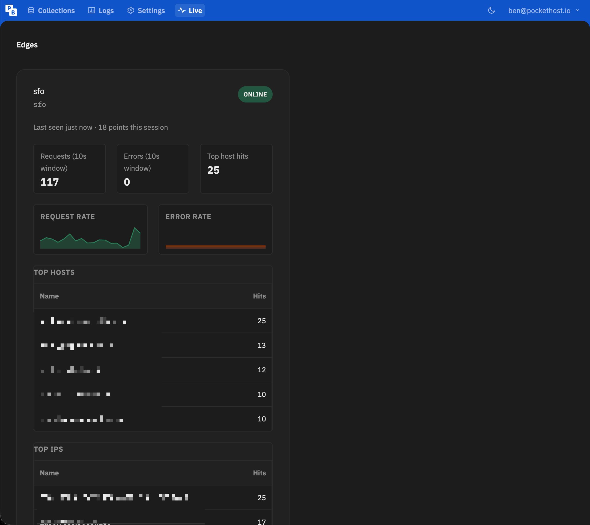

I shipped the first **mothership admin UI extension** this week: a **Live** page in the superuser dashboard for fleet counts, edge traffic, and session sparklines. The code path is fine. The surprise was **Cloudflare**.



### What admin UI extensions are

PocketBase **0.37+** lets you extend the built-in superuser dashboard without a separate app. Two layers:

1. **Server** — a `pb_hooks` `onServe` hook registers a static directory as a UI extension.
2. **Client** — `main.js` in that directory runs in the browser and uses global `window.app` to add routes, header links, and pages.

On PocketHost mothership the layout looks like this:

```
pb_hooks/mothership.pb.js     ← tsdown bundle (registration hook)
pb_admin_ext/live/main.js     ← client plugin code
pb_admin_ext/live/style.css
```

PocketBase serves `/_/extensions.js` (concatenated plugin entry) and `/_/extensions/{name}/*` (static assets). The admin SPA loads `/_/extensions.js` after you sign in as superuser.

This is separate from JSVM hooks. Client `main.js` runs normal browser JavaScript. Hook registration runs in Goja.

### How edges feed the Live page

The platform counts at the top (running, idle, failed, users) are mothership aggregates. The **Edges** section is different. Each edge node reports its own traffic window into mothership, and the Live plugin renders it in realtime.

**On the edge daemon**, `ProxyService` counts every proxied request: totals, errors, and top hosts, IPs, and countries (from `X-Forwarded-For` and `CF-IPCountry`). Counters live in memory for the current window only.

Every **10 seconds** (`PH_EDGE_HEARTBEAT_MS`), `EdgeHeartbeatService` snapshots that window, flushes the counters, and `POST`s to mothership:

```json
{
  "edge_id": "sfo",
  "label": "sfo",
  "stats": {
    "requests": 117,
    "errors": 0,
    "hosts": [["myapp.pockethost.io", 25], ...],
    "ips": [["203.0.113.1", 25], ...],
    "countries": [["US", 40], ...]
  }
}
```

`edge_id` defaults to the host hostname (`PH_EDGE_ID`). One record per edge in the mothership `edges` collection.

**On mothership**, `POST /api/edge/heartbeat` upserts that record: `last_seen`, `status: online`, and the `stats` JSON blob. A cron job runs every minute and downgrades edges with no heartbeat: **stale** after 30s, **offline** after 60s.

**In the Live plugin**, edges are the small collection that belongs on realtime (unlike 22k instances). On page load it `getFullList`s `edges`, then `subscribe('*')`. Each heartbeat patch appends a point to in-browser history for the request/error sparklines and refreshes the top-hosts, top-IPs, and top-countries tables. The headline numbers are always the latest 10s window from the edge.



### The bug that looked like a missing plugin

Symptom: `/_/extensions.js` returned **200** with an **empty body**. No header link. No errors in mothership logs. The registration hook was in the bundle. `main.js` existed on disk. Local curl to `:8090` returned the full script.

Production through Cloudflare did not.

Response headers told the story:

```
cf-cache-status: HIT
cache-control: max-age=1209600, stale-while-revalidate=86400
age: 6845
```

PocketBase sets a **14-day** cache header on `/_/*` static routes in production. Cloudflare cached an **empty** `/_/extensions.js` from before the plugin existed and kept serving it.

The plugin was not broken. The CDN was faithfully doing its job on a response that should never have been long-lived.

### The fix

A Cloudflare **Cache Rule** with **Bypass cache** for:

```
(http.request.uri.path eq "/_/extensions.js") or
(http.request.uri.path wildcard r"/_/extensions/*")
```

Both paths matter. `/_/extensions.js` is the bundle. `/_/extensions/*` is static assets. The wildcard does **not** match the `.js` file at the sibling path.

One purge of `/_/extensions.js` after saving the rule. Then hard refresh the admin UI.

I scoped the rule to the mothership hostname. Same pattern applies if you run admin plugins on a hosted instance behind Cloudflare.

Full step-by-step is in the [Admin UI Extensions docs](/docs/admin-extensions).

### The second bug (429 storm)

Once the script loaded, the Live page immediately started **hammering the API** and hit **429 Too Many Requests**.

Two causes stacked:

1. **Route init ran on every reactive re-render**, re-firing `getList` calls each time Shablon updated the page.
2. **`instances.subscribe('*')`** on a 22k-instance fleet fired constantly. Each burst triggered eight count queries (seven status filters + users).

Edges (small collection) belong on realtime. Platform-wide aggregates do not. I moved init to run once per page visit and poll platform counts every 30 seconds instead of listening to every instance patch.

If you build fleet-scale operator pages, treat admin extensions like any other dashboard: realtime for small sets, polling or incremental updates for aggregates.

### Where this goes

Mothership is on [PocketBase 0.39](/blog/mothership-pocketbase-v039) now. Admin extensions are the path for operator tooling that used to live in SQL views or external scripts.

The **Live** page is the first one. More mothership plugins will follow (stats, growth, fleet health). Customer instances on **≥0.37** can use the same pattern via SFTP/phio.

If you ship admin plugins on PocketHost, read the [Admin UI Extensions docs](/docs/admin-extensions) before you debug an empty `/_/extensions.js`. Check Cloudflare first.
