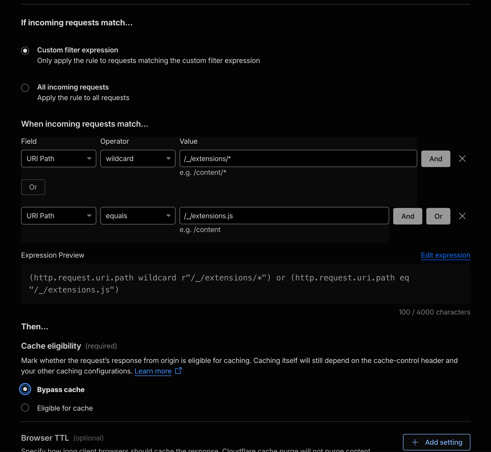

# Admin UI Extensions

PocketBase **0.37+** ships a rewritten superuser dashboard with an experimental **UI extension** system. You can add custom admin pages, header links, collection tabs, and field types without forking PocketBase or building a separate SPA.

This is different from [server-side hooks](/docs/js):

| Layer | Runs in | Purpose |
| ----- | ------- | ------- |
| **Server registration** | JSVM (`pb_hooks`) | Mount static files and register the extension with PocketBase |
| **Client code** | Browser (admin SPA) | `main.js` uses global `window.app` for routes, data, and UI |

Customer instances on PocketHost need PocketBase **≥0.37**. The mothership control plane runs **0.39**.

## Directory layout

Place extension assets next to your hooks. PocketHost mounts both via [SFTP](/docs/ftp) or [phio](/docs/phio):

```
pb_hooks/
  admin_plugins.pb.js       ← server registration (JSVM)
pb_admin_ext/
  my-plugin/
    main.js                   ← client entry (required for UI hooks)
    style.css                 ← optional static assets
```

On the mothership repo, registration hooks are bundled by tsdown into `pb_hooks/mothership.pb.js`. Static trees under `pb_admin_ext/` are plain files and must ship beside `pb_hooks/` on deploy.

## Server registration

Register the extension in an `onServe` hook. Each `name` becomes a URL segment under `/_/extensions/{name}/`.

```js
// pb_hooks/admin_plugins.pb.js
$app.onServe().bindFunc((e) => {
  e.uiExtensions.push({
    name: 'my-plugin',
    fs: $os.dirFS(`${__hooks}/../pb_admin_ext/my-plugin`),
  })
  e.next()
})
```

PocketBase automatically exposes:

| Route | Purpose |
| ----- | ------- |
| `GET /_/extensions/{name}/{path...}` | Static files from the extension directory |
| `GET /_/extensions.js` | Concatenated `main.js` from all registered extensions |

Restart PocketBase after changing **registration** (the hook). Edits to `main.js` alone often show up after a browser refresh because PocketBase rebuilds `/_/extensions.js` from disk on each request.

## Client entry (`main.js`)

Client code runs in the **browser**. Modern JavaScript is fine (`async`/`await`, DOM APIs). It is **not** subject to JSVM restrictions.

```js
// pb_admin_ext/my-plugin/main.js
app.store.headerLinks.push({
  href: '#/my-plugin',
  icon: 'ri-pulse-line',
  label: 'My Plugin',
})

app.routes.superuserOnly('#/my-plugin', () => {
  return t.div({ className: 'page' }, t.h1(null, 'Hello from an admin plugin'))
})
```

Load extension CSS with paths under `/_/extensions/{name}/`:

```js
document.head.appendChild(
  t.link({
    rel: 'stylesheet',
    href: '/_/extensions/my-plugin/style.css',
  })
)
```

Use `app.pb` for data access. It inherits superuser auth from the admin session.

## Deploy on PocketHost

1. Upload `pb_hooks/*.pb.js` and `pb_admin_ext/**` together via SFTP or phio.
2. Restart the instance (or mothership) so hook registration loads cleanly.
3. Open the admin UI (`/_/`), sign in as superuser, and check for your header link.

Verify from the command line:

```bash
curl -sI https://your-instance.pockethost.io/_/extensions.js | grep -iE 'content-length|cache-control'
curl -s https://your-instance.pockethost.io/_/extensions/my-plugin/main.js | head
```

`/_/extensions.js` should return JavaScript with a non-zero body when `main.js` exists.

## Cloudflare caching (important)

PocketHost serves admin traffic through **Cloudflare**. In production (non-`--dev`), PocketBase sets a long cache header on most `/_/*` static routes:

```
Cache-Control: max-age=1209600, stale-while-revalidate=86400
```

That is **14 days**. Cloudflare honors it.

`/_/extensions.js` is rebuilt from disk on every origin request, but the CDN can still serve a **stale cached copy** for days. Symptom: the admin UI loads, `/_/extensions.js` returns **200**, but the body is **empty** or outdated after you deploy a new plugin.

This bit us on the mothership **Live** operator dashboard. The plugin was registered correctly on the server. Cloudflare kept serving an empty cached bundle from before registration existed.

### Fix: bypass cache for extension routes

In the Cloudflare dashboard for your zone, add a **Cache Rule**:



**If** (custom expression):

```
(http.request.uri.path eq "/_/extensions.js") or (http.request.uri.path wildcard r"/_/extensions/*")
```

Scope to your hostname when possible (mothership or instance custom domain):

```
(http.host eq "pockethost-central.pockethost.io") and (
  (http.request.uri.path eq "/_/extensions.js") or
  (http.request.uri.path wildcard r"/_/extensions/*")
)
```

**Then:** Cache eligibility → **Bypass cache**

Both paths matter:

- `/_/extensions.js` is the bundled entry the admin SPA loads.
- `/_/extensions/*` serves static assets (`style.css`, images).

The wildcard `/_/extensions/*` does **not** match `/_/extensions.js`. You need both conditions.

After saving the rule, **purge cache once** for `/_/extensions.js`. An old HIT will not clear itself.

Verify:

```bash
curl -sI https://your-host/_/extensions.js | grep -i cf-cache-status
```

You want `BYPASS` or `MISS`, not `HIT` with an old `age`.

### Local dev

When you run mothership with `--dev`, PocketBase skips the 14-day cache header on `/_/*`. Local testing without Cloudflare will not reproduce the CDN issue.

## Realtime vs polling in client code

Admin plugin routes use Shablon reactive rendering. If your route callback re-runs setup code on every render, you can accidentally fire API calls in a loop.

For fleet-scale data (thousands of instances):

- Subscribe to **small collections** (e.g. `edges`) with realtime.
- Poll **aggregate counts** on an interval instead of subscribing to `instances/*` and re-querying on every event.
- Run initialization once per page visit, not on every reactive update.

## API status

Admin UI extensions are **experimental** in PocketBase as of 0.37–0.39. Expect API shape changes before v1.0. Inspect `console.log(app)` in DevTools on your target PocketBase version.

## Related docs

- [Extending via JS](/docs/js) — JSVM hooks (server-side, not admin SPA)
- [SFTP File Access](/docs/ftp) — upload hooks and extension files
- [phio CLI](/docs/phio) — deploy hooks and sibling directories
- [Publishing Static Assets](/docs/static-assets) — Cloudflare caching for `pb_public`
