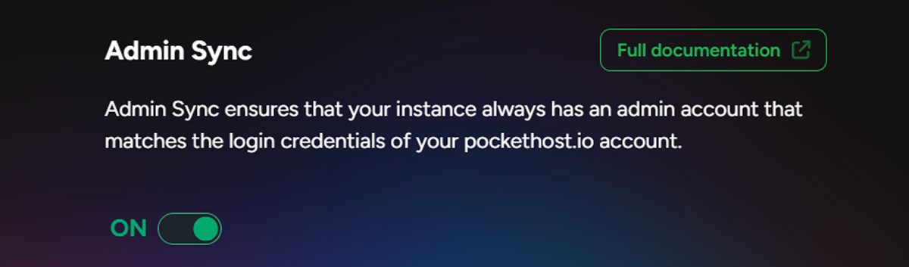
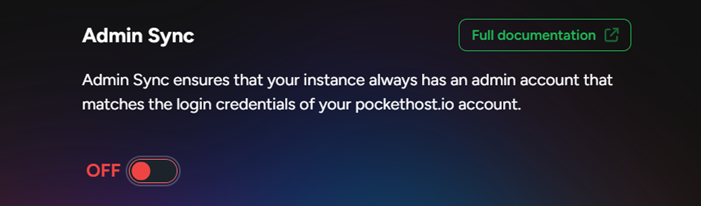

# Admin Sync

Admin Sync ensures that your instance always has an admin account that matches the login credentials of your pockethost.io account.

## Enabling Admin Sync

When Admin Sync is enabled, your pockethost.io account credentials are automatically copied as an admin login to your instance before it launches.

If you update your pockethost.io credentials while an instance is running, the new credentials will not be synced until the instance is restarted. To apply the changes immediately, [power down the instance](/docs/power) and relaunch it.

By default, Admin Sync is enabled, ensuring that when an instance is created, it has an admin account matching your pockethost.io login. This security feature prevents unauthorized users from creating the initial admin account.

## Disabling Admin Sync

When Admin Sync is disabled, your pockethost.io credentials will no longer be copied to your instance in future launches.
