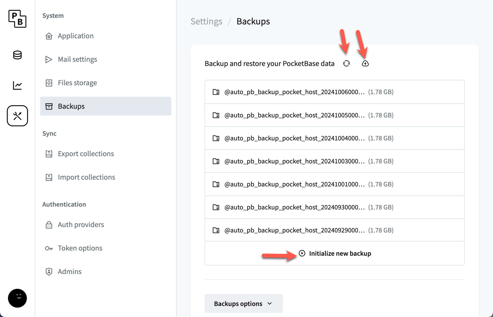

# Backing Up and Restoring

PocketBase offers built-in backup and restore features, making it easy to secure your data and recover from potential issues. However, there are important considerations and alternative methods to ensure your backups are safe and reliable.

## Backup and Restore via Admin

PocketBase has a simple backup and restore feature available directly from the admin panel. You can create backups of your instance's data and restore from those backups when needed.

- **No need to power off**: You can perform backups and restores through the admin panel without powering off your instance, ensuring minimal disruption to your application.

However, if your instance becomes unresponsive or the admin interface is inaccessible, you may need to use alternative methods for backing up and restoring.

## Backup and Restore via FTP

If the admin panel’s backup and restore feature is unavailable or your instance is unresponsive, you can manually back up your data via [FTP](/docs/ftp). This allows you to access all PocketBase files, including the database and uploads, so you can create manual backups and restore them if necessary.

## S3 and Scheduled Backups

Automating your backups is a recommended practice, especially as your instance grows in complexity and usage. However, there are some important caveats:

- **Hibernation**: If your instance is in [hibernation](/docs/limits), automated backups may fail to execute. Waking up the instance on a schedule will not trigger any missed backup intervals. As your instance becomes busier, hibernation will become less frequent, minimizing this issue. To learn more, see [S3](/docs/s3) and [Cron](/docs/cron).

- **S3 backups**: Backing up to S3 (or another external storage solution) is highly recommended. Using S3 allows you to conserve your PocketHost storage space for critical resources such as your database and logs, which cannot be stored elsewhere. Files such as uploads and backups, on the other hand, can easily live on S3.

- **FTP access to backups**: Note that backups stored in S3 are **not** accessible via FTP. You will need to manage these backups directly through S3 or your chosen storage provider.

## Best Practices

To ensure your data is always secure:

1. **Regularly back up** your instance using the admin panel or automated methods like S3.
2. **Use external storage** (e.g., S3) for backups and file uploads to avoid consuming valuable PocketHost storage space.
3. If automating backups, ensure your instance is awake and running during scheduled backup intervals.
4. Keep in mind that **manual FTP backups** are available if your instance becomes inaccessible via the admin panel.

By following these practices, you can maintain a reliable backup strategy and ensure your data is safe.
