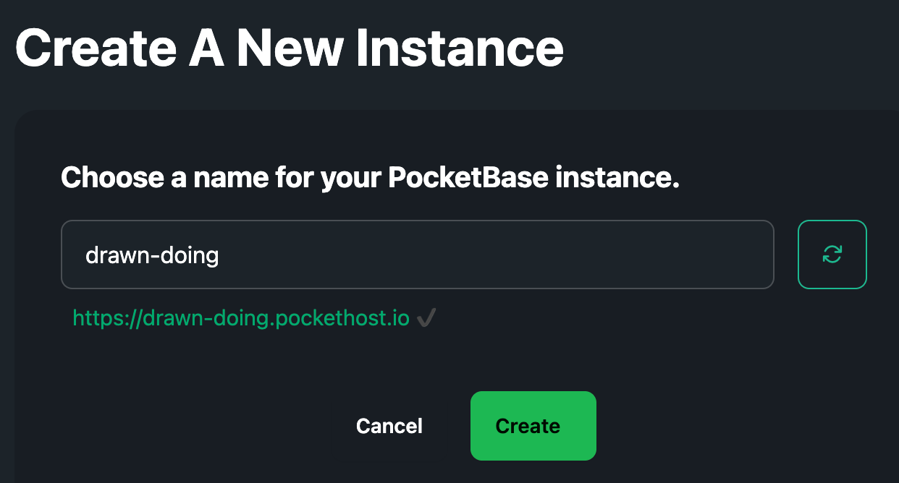

# Creating an Instance

Each PocketHost instance runs on its own unique subdomain. To create a new instance, simply go to [Create New Instance](/instances/new).

Choose a unique name for your instance, and that’s it! Your new PocketBase instance will be up and running in no time.
