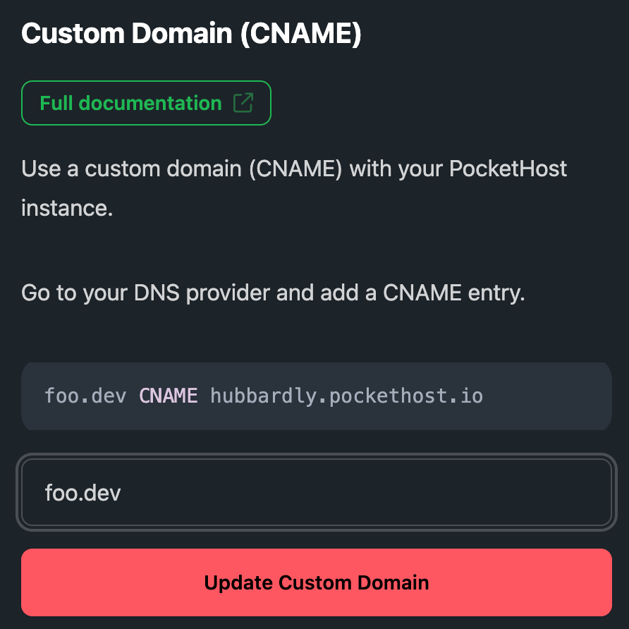

# Custom Domains

PocketHost instances can use a custom domain (CNAME) instead of the default `*.pockethost.io` (Pro feature only).

## Overview

We recommend using Cloudflare, as they support [CNAME flattening](https://developers.cloudflare.com/dns/cname-flattening/), which allows you to use a root domain like `mydomain.com` instead of a subdomain like `foo.mydomain.com`.

After configuring your CNAME, navigate to the Settings tab of your instance in the PocketHost Dashboard to add your custom domain (Pro feature only).

To complete the setup and verify the domain, you will need to contact [PocketHost Support](/support). This is also required any time you change the domain.

## Transferring Name Server Control Without Moving the Domain

A common misconception is that you need to transfer your domain from its current registrar to manage DNS settings with Cloudflare. However, this is not the case. You can retain your domain at your current registrar and simply transfer name server control to Cloudflare. Here's how:

1. Sign up for a Cloudflare account and add your domain.
2. Cloudflare will provide you with two name servers (NS records).
3. Update your domain's name server records at your current registrar to point to the Cloudflare name servers.
4. Once updated, you can manage your DNS settings, including adding a CNAME for your PocketHost instance, via Cloudflare while keeping your domain at your original registrar.

This process allows you to take advantage of Cloudflare's DNS management and features, such as CNAME flattening, without transferring your domain away from your registrar.

## CNAME Flattening

CNAME flattening is a feature provided by Cloudflare that allows you to point a root domain (e.g., `mydomain.com`) to another domain, such as your PocketHost instance, which typically requires a CNAME record. Normally, CNAME records are only supported on subdomains (e.g., `foo.mydomain.com`), but Cloudflare’s CNAME flattening lets you use a root domain for the same purpose.

By enabling CNAME flattening, you can set up your custom domain to resolve directly to your PocketHost instance, even if it's on the root level, ensuring a seamless experience for users accessing your site.

## Static Files and Custom Domains

When you set up a custom domain with PocketHost, all static files in the `pb_public` directory of your instance will also be served through your custom domain. These static files are accessible over HTTPS, providing a secure and reliable solution for serving static sites and assets. This is an ideal setup for static site generation (SSG) projects or simple static websites.

With this configuration, you can host static files like HTML, CSS, and JavaScript directly on your PocketHost instance and deliver them through your custom domain, complete with SSL encryption, without the need for an external hosting provider.
