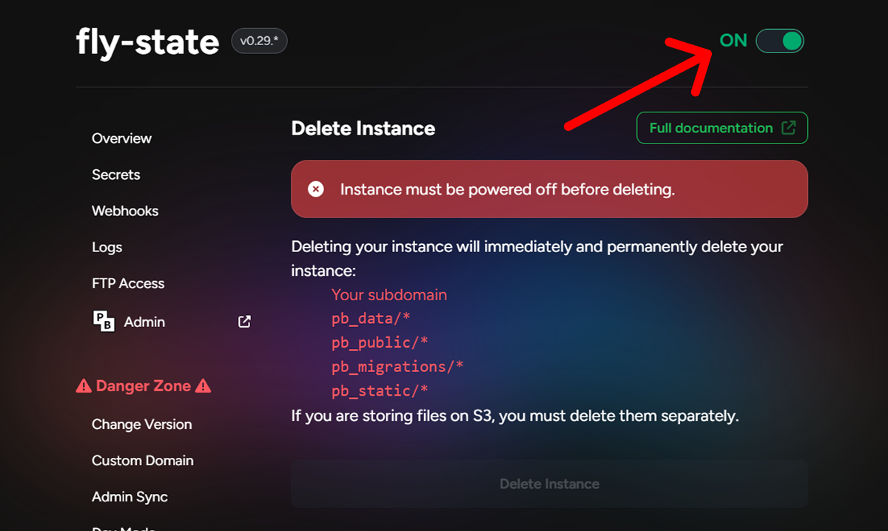
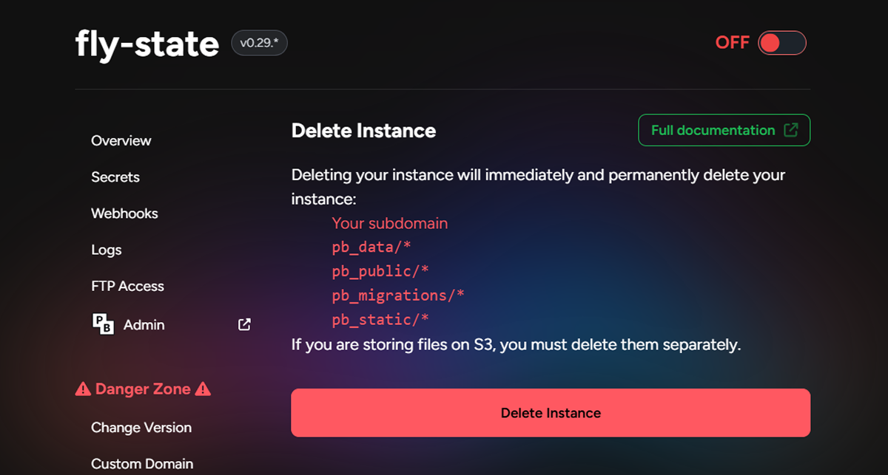

# Deleting an Instance

Deleting an instance will immediately power it down and permanently remove all associated data.

Before you can delete an instance, it must first be [powered off](/docs/power).

Once deleted, the following will be permanently erased:

- Your subdomain
- All files in `pb_data/*`
- All files in `pb_public/*`
- All files in `pb_migrations/*`
- All files in `pb_static/*`

