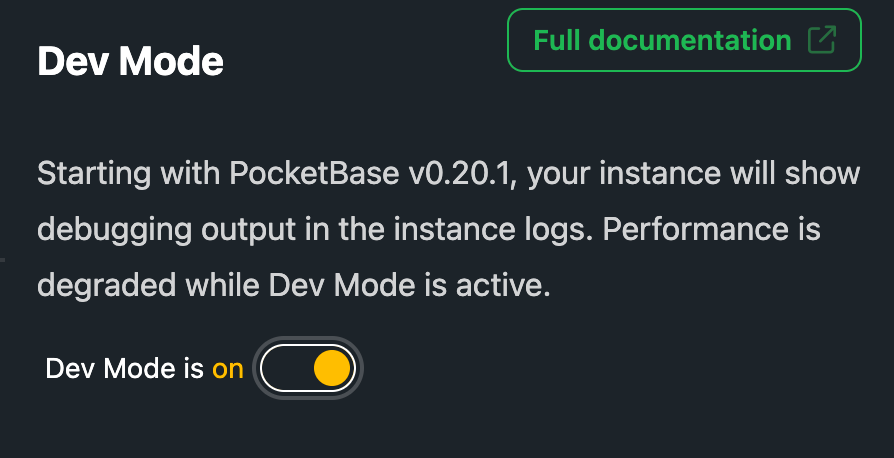

# Dev Mode

Begining with PocketBase 0.20.1, you may supply a `--dev` flag to make PocketBase output debugging information to the console.

PocketHost supports this through the Dev Mode switch. When running in Dev Mode, your instance logs will show all debugging output.
