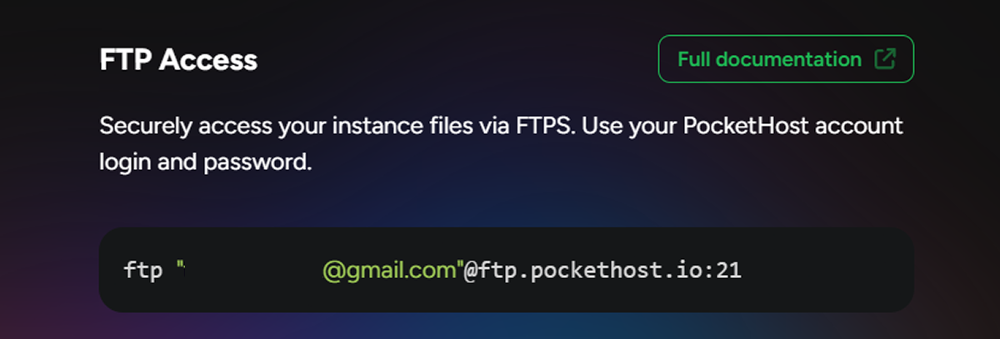
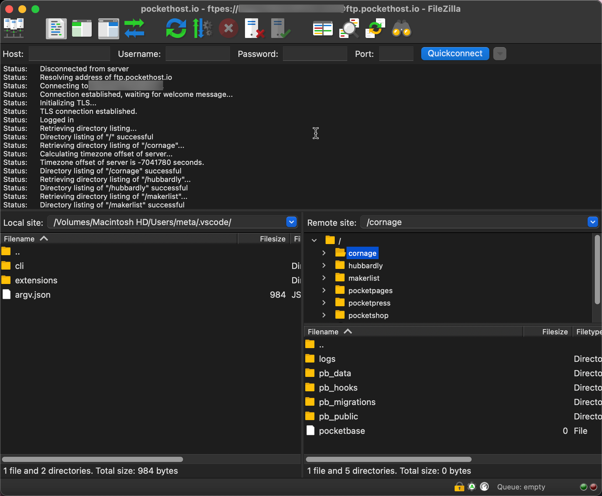

# FTP Access 

PocketHost provides explicit FTPS (FTP over TLS) access to all your PocketBase files. Plain FTP without TLS is not supported.

## Connecting

- **Host**: `ftp.pockethost.io`
- **Port**: `21`
- **Username**: your pockethost.io email address
- **Password**: your pockethost.io password
- **Encryption**: explicit FTPS (AUTH TLS). Not implicit FTPS on port 990.





Upon login, you'll see a directory for each instance associated with your account. Inside each instance directory, you'll find the following:

| Directory Name  | Description                                    | Instructions                                                                       |
| --------------- | ---------------------------------------------- | ---------------------------------------------------------------------------------- |
| pb_data         | The PocketBase data directory                  | [View details](https://pocketbase.io/docs/going-to-production/)                    |
| pb_data/backups | The PocketBase database backups                | [View details](https://pocketbase.io/docs/going-to-production/#backup-and-restore) |
| pb_data/storage | The PocketBase uploaded file storage directory | [View details](https://pocketbase.io/docs/files-handling/)                         |
| pb_public       | The directory for public static files          | [View details](https://pocketbase.io/docs)                                         |
| pb_migrations   | The PocketBase migrations directory            | [View details](https://pocketbase.io/docs/migrations/)                             |
| pb_hooks        | The PocketBase JS hooks directory              | [View details](https://pocketbase.io/docs/js-overview/)                            |

## CLI (lftp)

PocketHost requires TLS. Use [lftp](https://lftp.yar.ru/) \[[Homebrew](https://formulae.brew.sh/formula/lftp)\] — the macOS `ftp` command does not support FTPS.

  ```bash
  lftp -c 'set ftp:ssl-force true; set ftp:ssl-protect-data true; set ssl:verify-certificate no; open -u "you@example.com","YOUR_PASSWORD" ftp://ftp.pockethost.io:21; ls; quit'
  ```

Replace `you@example.com` and `YOUR_PASSWORD` with your PocketHost credentials. Omit `; ls; quit` to stay connected interactively.

## GUI (FileZilla)

- **Protocol**: FTP — File Transfer Protocol
- **Encryption**: Require explicit FTP over TLS
- **Host**: `ftp.pockethost.io`
- **Port**: `21`
- **Logon type**: Normal
- **User**: your pockethost.io email
- **Password**: your pockethost.io password

Other GUI clients (WinSCP, Cyberduck, etc.) work if they support explicit FTPS on port 21.

## Other clients

- [FileZilla](https://filezilla-project.org/) — recommended GUI client
- [lftp](https://lftp.yar.ru/) — recommended CLI client
- [wget](https://www.gnu.org/software/wget/) — download-only; configure FTPS options for your use case
