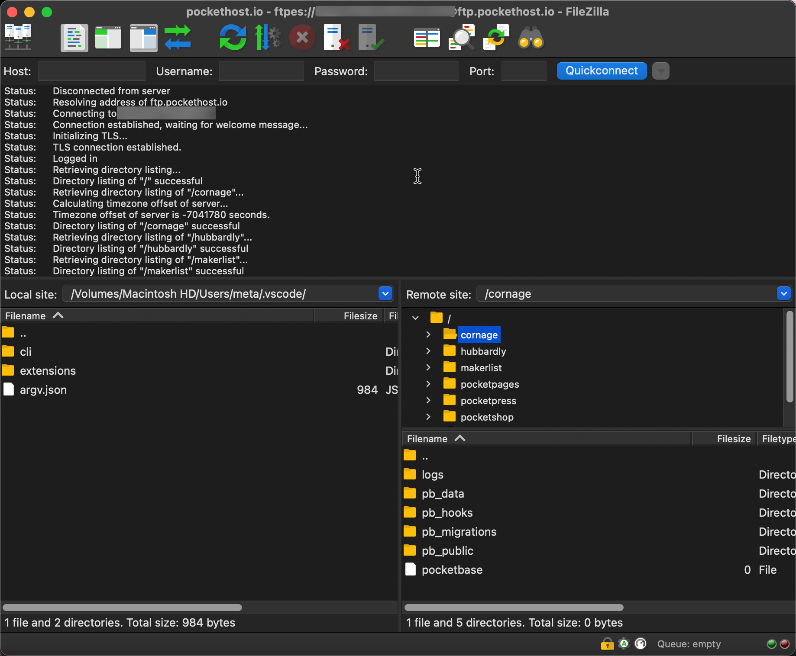

# FTP Access 

PocketHost provides Secure FTP (FTPS) access to all your PocketBase files.

## Accessing via FTP

Use the FTP address provided via `ftp.pockethost.io`. You log in with your pockethost.io username and password.

Upon login, you'll see a directory for each instance associated with your account. Inside each instance directory, you'll find the following:

| Directory Name  | Description                                    | Instructions                                                                       |
| --------------- | ---------------------------------------------- | ---------------------------------------------------------------------------------- |
| pb_data         | The PocketBase data directory                  | [View details](https://pocketbase.io/docs/going-to-production/)                    |
| pb_data/backups | The PocketBase database backups                | [View details](https://pocketbase.io/docs/going-to-production/#backup-and-restore) |
| pb_data/storage | The PocketBase uploaded file storage directory | [View details](https://pocketbase.io/docs/files-handling/)                         |
| pb_public       | The directory for public static files          | [View details](https://pocketbase.io/docs)                                         |
| pb_migrations   | The PocketBase migrations directory            | [View details](https://pocketbase.io/docs/migrations/)                             |
| pb_hooks        | The PocketBase JS hooks directory              | [View details](https://pocketbase.io/docs/js-overview/)                            |

## Recommended FTP Clients

### GUI

- [FileZilla](https://filezilla-project.org/) – A robust GUI frontend available for all platforms.
- [ftp-simple](https://marketplace.visualstudio.com/items?itemName=humy2833.ftp-simple) – A VSCode plugin for managing FTP access.

### CLI

- [ftp](https://ftp.gnu.org/)
- [wget](https://www.gnu.org/software/wget/) \[[Homebrew](https://formulae.brew.sh/formula/wget)]
- [lftp](https://lftp.yar.ru/) \[[Homebrew](https://formulae.brew.sh/formula/lftp)]
