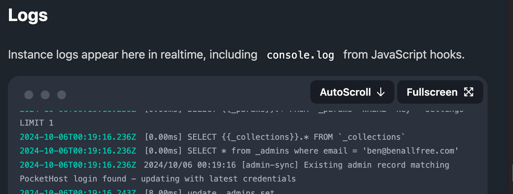

# Logging

You can view live logs while your PocketHost instance is running. `console.log` output from `pb_hooks` scripts will also appear in these logs.

For enhanced logging, use [Dev mode](/docs/dev-mode).

These logs are also accessible in the logging area of your PocketBase admin dashboard.
