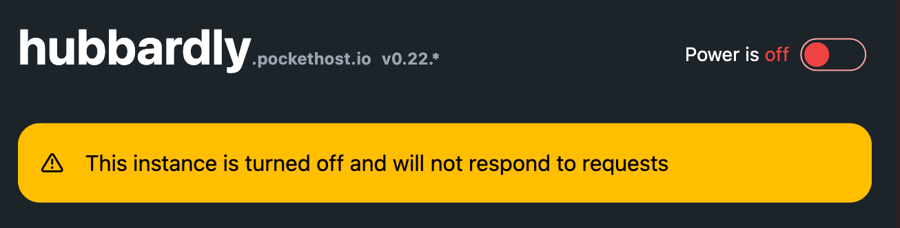

# Power

## Power On

To power on the instance, follow these steps:

1. Open the instance management console.
2. Locate the power button and click on it.
3. The instance is now active.

Once powered on, your PocketBase instance will be able to receive requests and respond accordingly.

## Power Off

To power off the instance, follow these steps:

1. Open the instance management console.
2. Locate the power button and click on it.
3. Wait for the instance to shut down.

When the instance is powered off, no requests will be answered.
