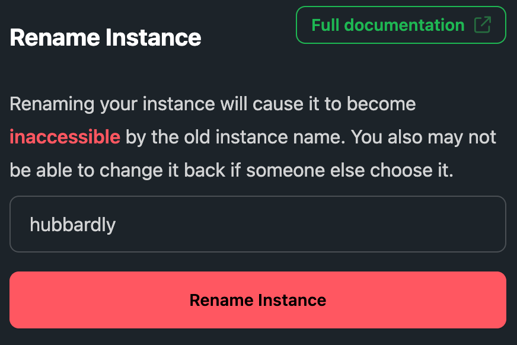

# Rename an Instance

PocketHost instances can always be accessed via their permanent link, such as `https://mfsicdp6ia1zpiu.pockethost.io`, but you can also access them through a convenient subdomain like `https://harvest.pockethost.io`.

The subdomain is unique across all of PocketHost, but you can change it at any time. When you change your subdomain, the old one becomes available for others to claim. Be sure to choose wisely if you plan to release it.

