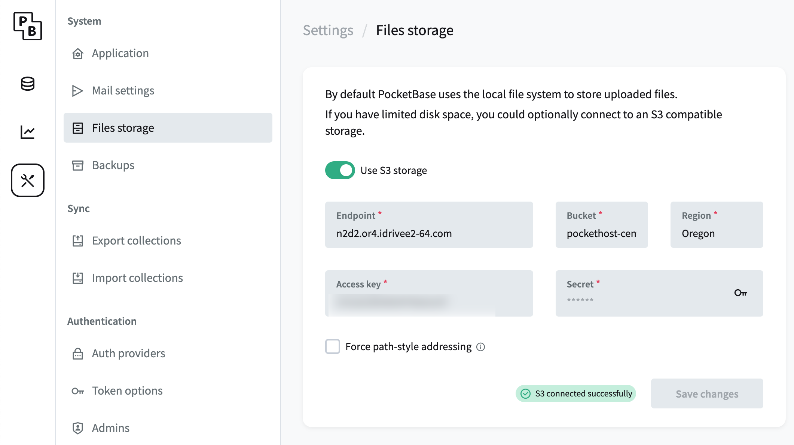

# S3 Storage and PocketBase

Using S3-compatible storage for PocketBase can help optimize your instance's resource management and portability. Here’s what you need to know about integrating S3 storage with PocketBase.

## Affordable S3-Compatible Storage

One highly affordable option for S3-compatible storage is **iDrive**, which offers competitive pricing and reliable service. You can configure PocketBase to use iDrive or any other S3-compatible provider to store files, backups, and other resources.

## What S3 Storage Supports

S3 storage works seamlessly with PocketBase for the following use cases:

- **Backups**: Store PocketBase backups in S3-compatible storage to keep them off your local instance.
- **Restores**: Use S3 storage as a source when restoring backups to your PocketBase instance.
- **File uploads**: Move your PocketBase file uploads to S3 to free up local storage.

By offloading these tasks to S3, you can reduce the burden on your PocketHost instance’s local storage.

## Storage Conservation

Using S3 for files like uploads and backups helps conserve your local storage for more critical data, such as **databases and logs**, which must reside on your instance. This helps your PocketHost instance run more efficiently. Learn more about storage limits in [Limits](/docs/limits).

## Migrating Files to S3

If you need to move a large number of files from your PocketHost instance to S3, feel free to reach out to [PocketHost Support](/support) for assistance. They can help you streamline the migration process.

## Portability and Migration

By storing files in S3, your PocketBase instance becomes far more **portable**. If you ever decide to migrate away from PocketHost, having your files already stored in S3 makes it easier to transition to another hosting provider.

## Important Backup Consideration

Be aware that **PocketBase backups do NOT include storage files** that have been moved to S3. When creating a backup, only the local database and file system are included. You’ll need to manage S3-stored files separately to ensure complete backup coverage.
