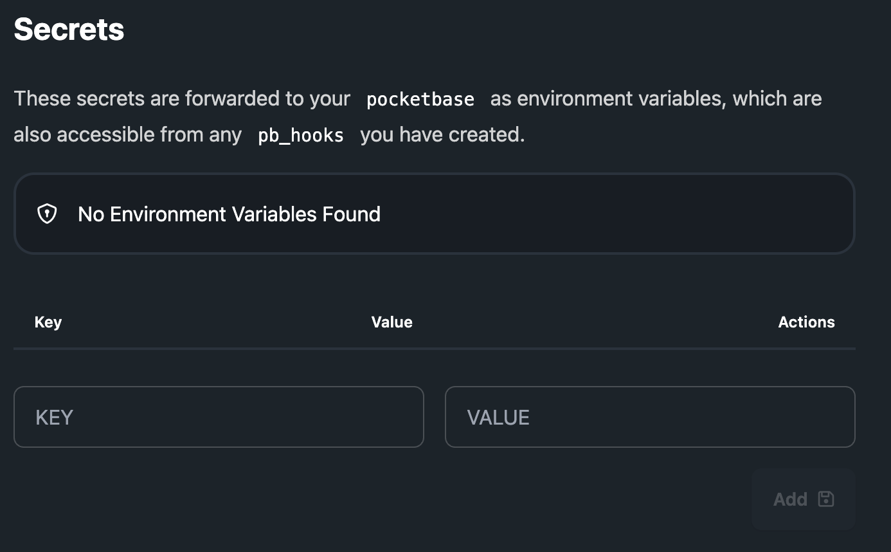

# Secrets

Secrets are created through the PocketHost instance dashboard and are automatically made available in the PocketBase runtime environment, including `pb_hooks`. Use secrets to securely store API keys and other sensitive information that should not be embedded in your source code.

