# Speedrun: Setting Up Email with Google Suite and AWS SES

<!-- @import "[TOC]" {cmd="toc" depthFrom=2 depthTo=6 orderedList=false} -->

<!-- code_chunk_output -->

- [Prerequisite: Make sure you can receive emails first](#prerequisite-make-sure-you-can-receive-emails-first)
- [Create an SES Identity](#create-an-ses-identity)
- [Add DNS Records](#add-dns-records)
- [Add a custom FROM domain](#add-a-custom-from-domain)
- [Add DMARC settings](#add-dmarc-settings)
- [Verifying the Setup](#verifying-the-setup)
- [Submit for Approval](#submit-for-approval)
- [Creating SMTP Credentials](#creating-smtp-credentials)
- [Configure SMTP in PocketBase](#configure-smtp-in-pocketbase)

<!-- /code_chunk_output -->

## Prerequisite: Make sure you can receive emails first

To receive emails, you'll need an email provider. I use Google Suite, but you can choose any provider you prefer.

[Setting up a new email domain in Google Suite](/docs/speedruns/gs-gmail).

(Someone should write about how to do it using Proton.me)

## Create an SES Identity

Log in to your Amazon SES account and follow their getting started guide to create a FROM address and sending domain. Make sure you're in the region you prefer. This is important if you have existing domains because AWS frowns upon approving multiple sending regions.

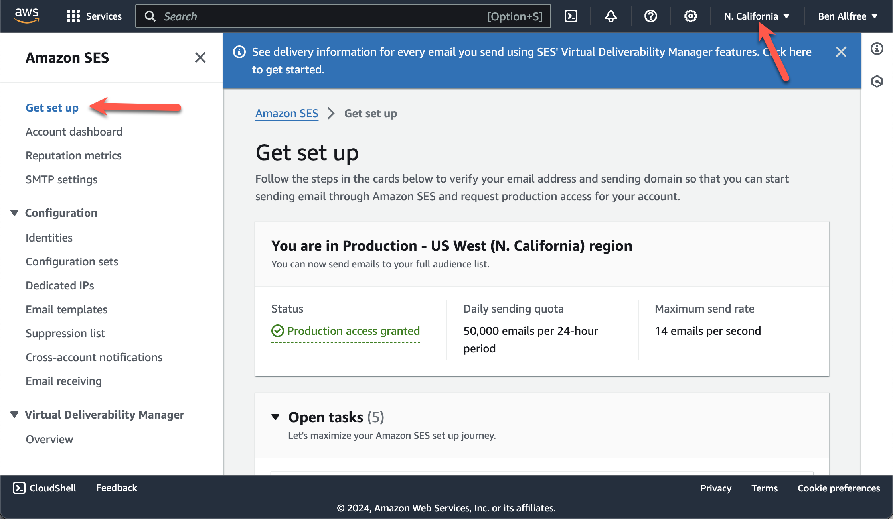

Start by creating an Identity:

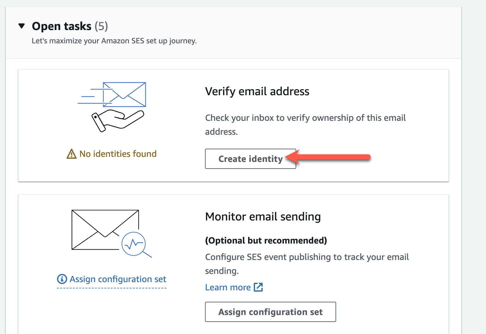

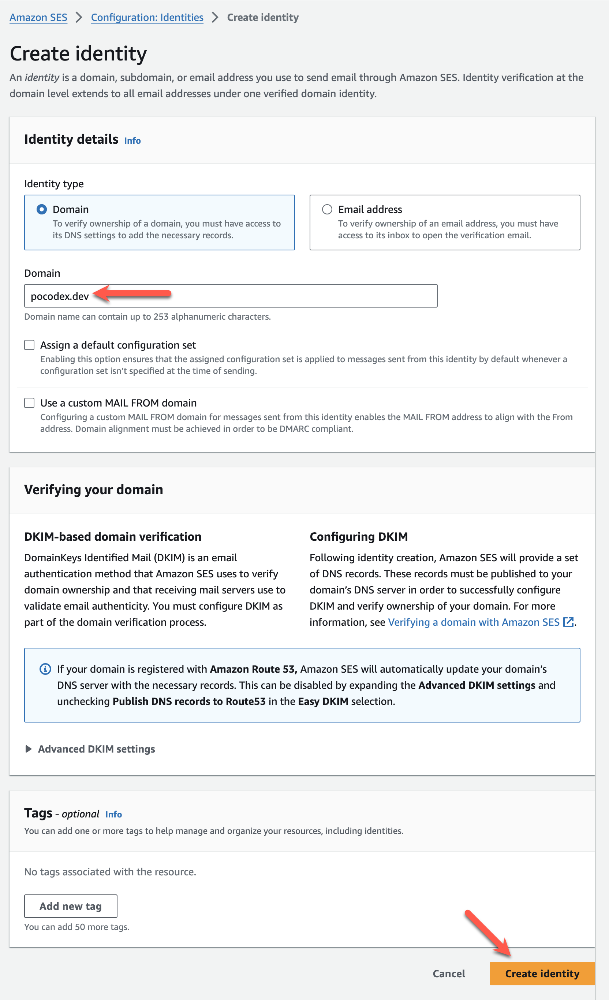

## Add DNS Records

You'll need to add DNS records provided by SES to your DNS provider. Unlike Google Suite, you'll need to enter these values manually. They do not provide integrations with any DNS providers.

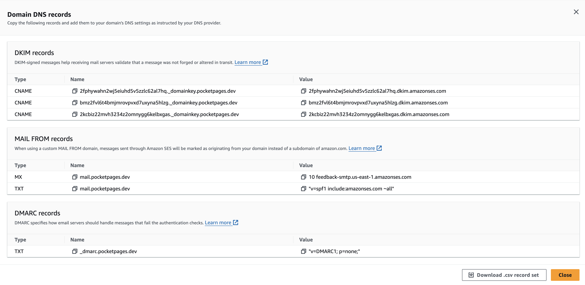

**Note for Cloudflare users: If you’re using Cloudflare, make sure these records are not proxied.**

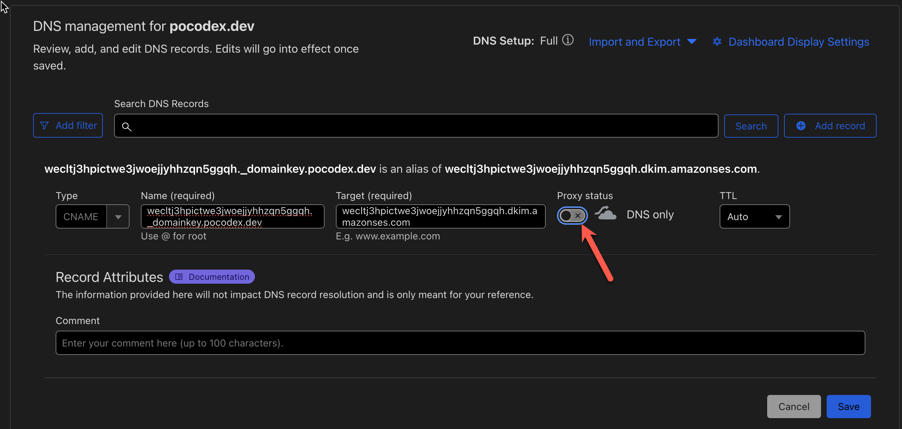

## Add a custom FROM domain

Deliverability is better if you add a custom FROM domain:

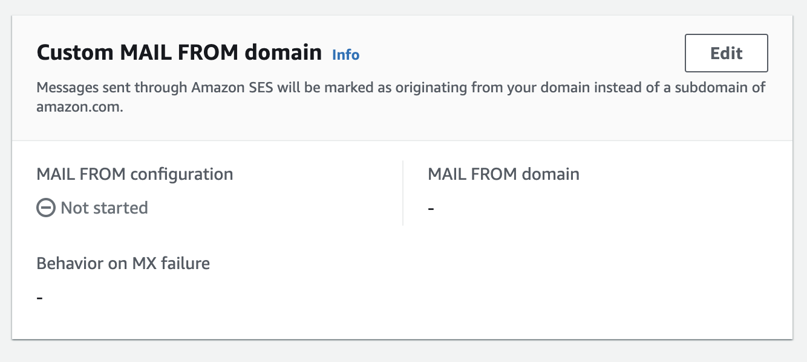

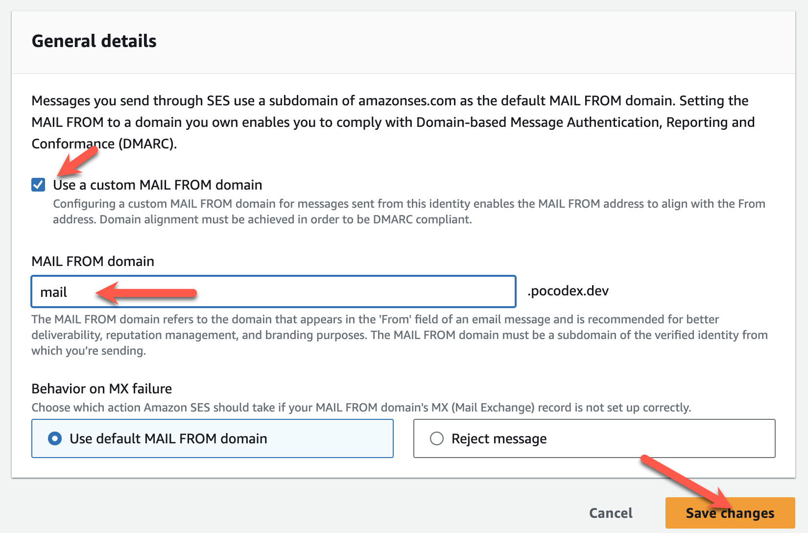

It requires a few additional DNS entries. Note that the MX `priority` goes into a separate field, not the MX server field:

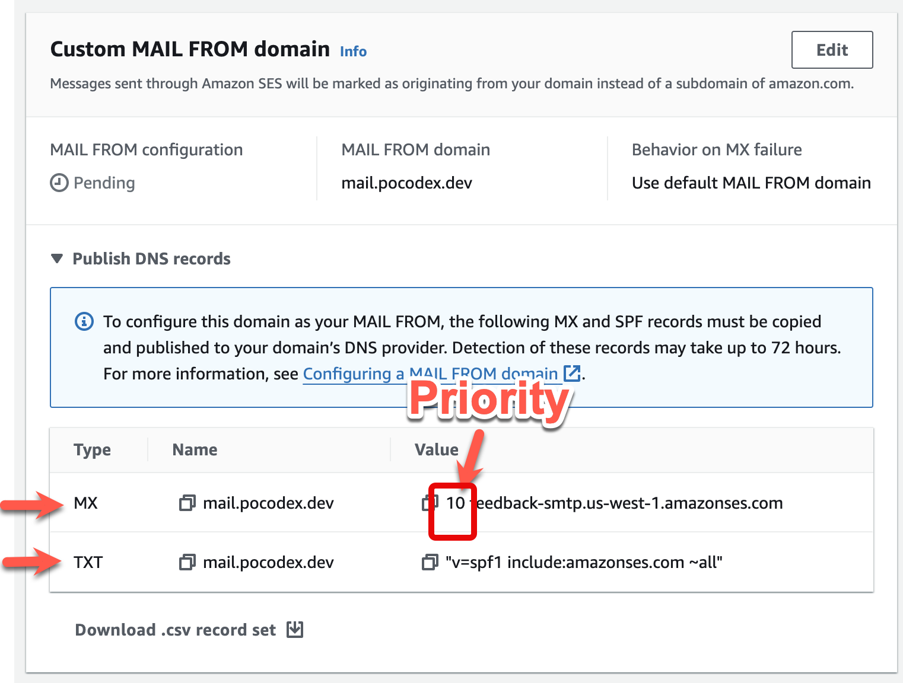

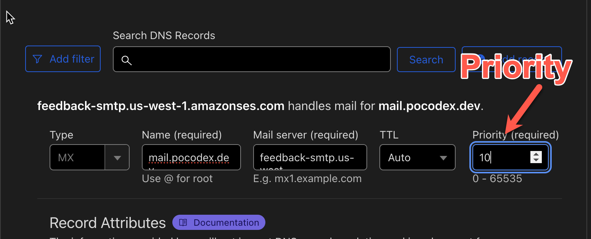

## Add DMARC settings

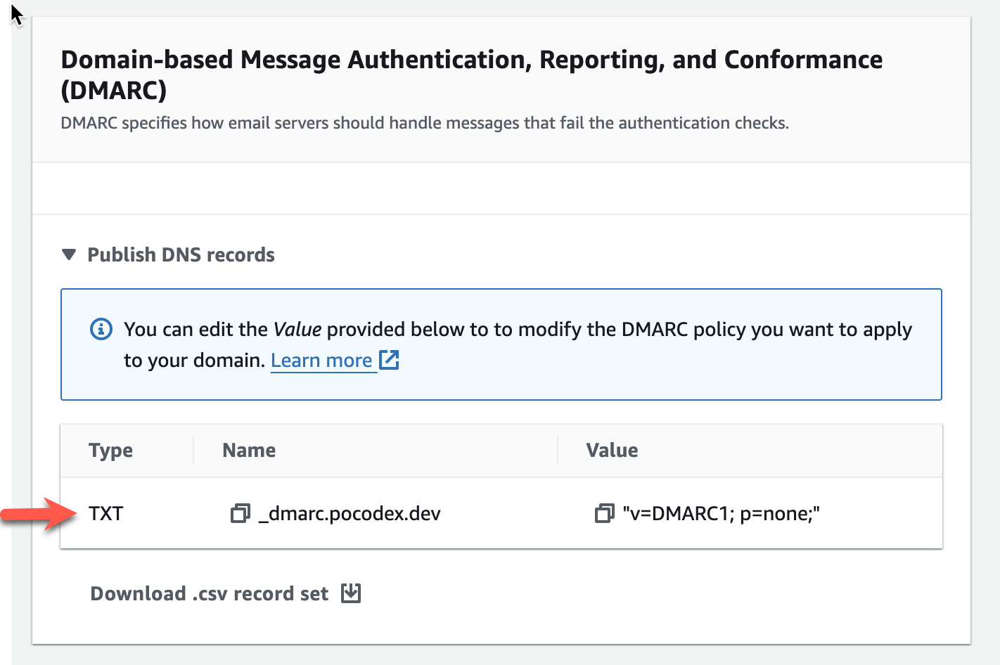

## Verifying the Setup

After adding the DNS records, go back to AWS SES and wait for the domain to show as verified. Then, send a verification email. You should receive it if everything is set up correctly.

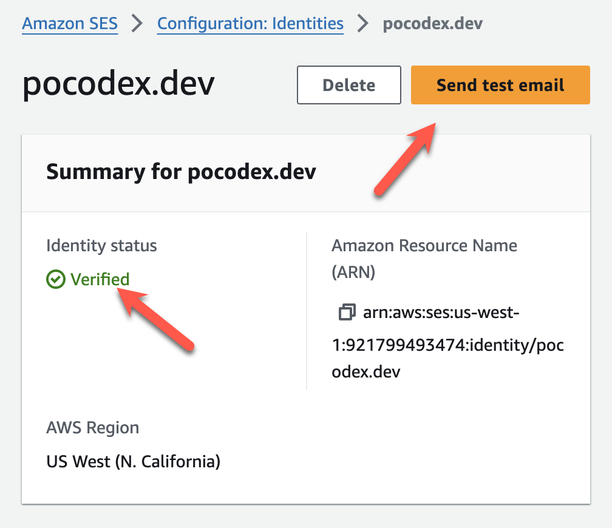

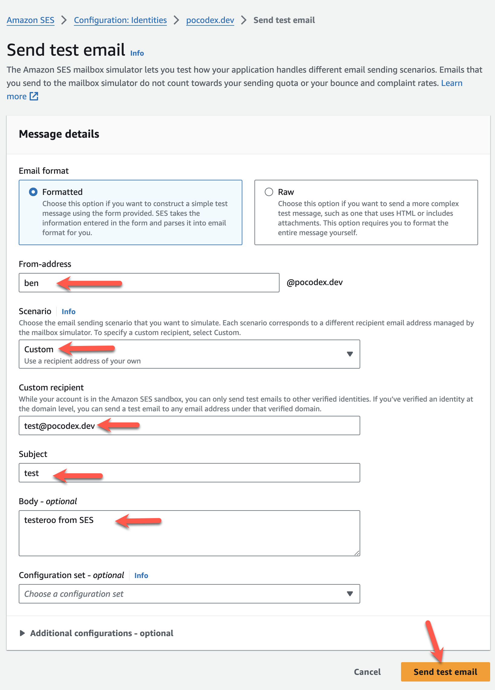

If verification takes too long, go to **Identities > DKIM**, click **Edit**, then **Save** to trigger an immediate re-verification.

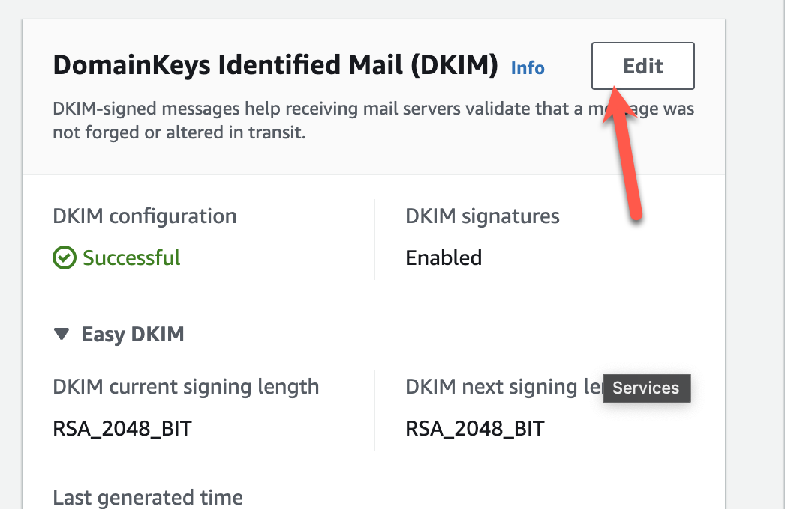

## Submit for Approval

Before you can send emails to anyone, you must submit everything for approval in AWS SES. This step is crucial to avoid issues when sending emails outside your verified domain.

If you have previously had a domain approved, you may be able to skip this step. To find out, simply try sending a test message to anything with a different domain.

## Creating SMTP Credentials

Create SMTP credentials in the AWS SES console. These credentials will be used in your PocketBase admin panel for sending emails.

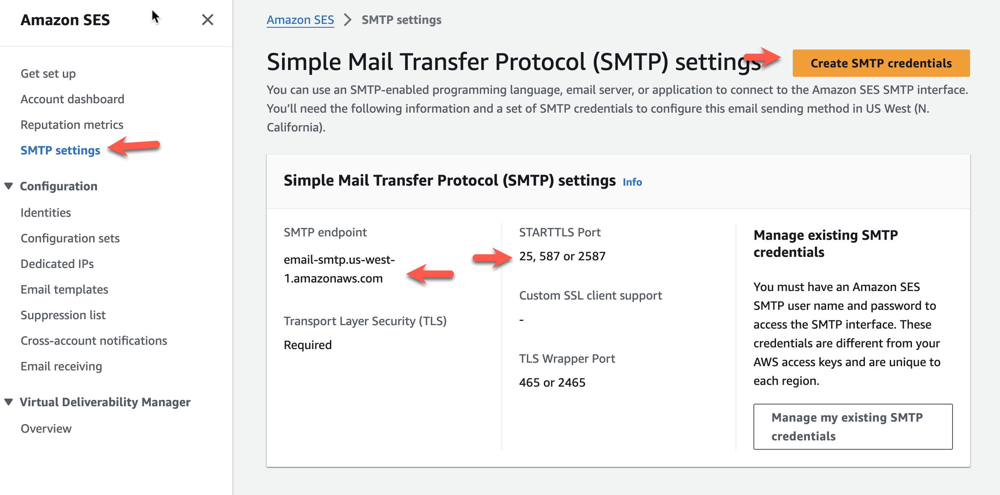

## Configure SMTP in PocketBase

Once you have your SMTP credentials, head over to the PocketBase admin.

Enter the SMTP credentials in PocketBase's admin panel, and ensure the **SENDER** address is correctly set. If SES hasn't verified your email yet, you can test it by sending an email to `test@<yourdomain>`, which should go through if the domain is the same.

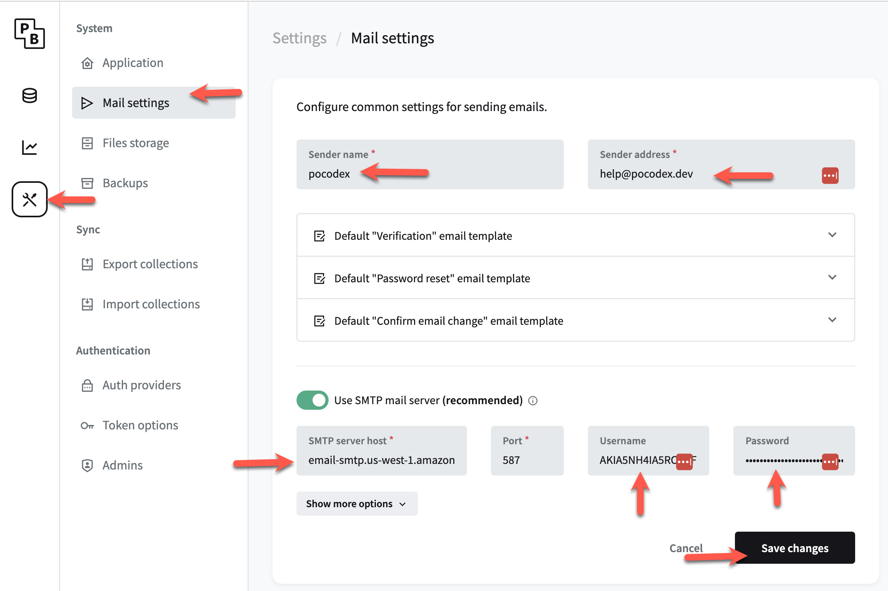
