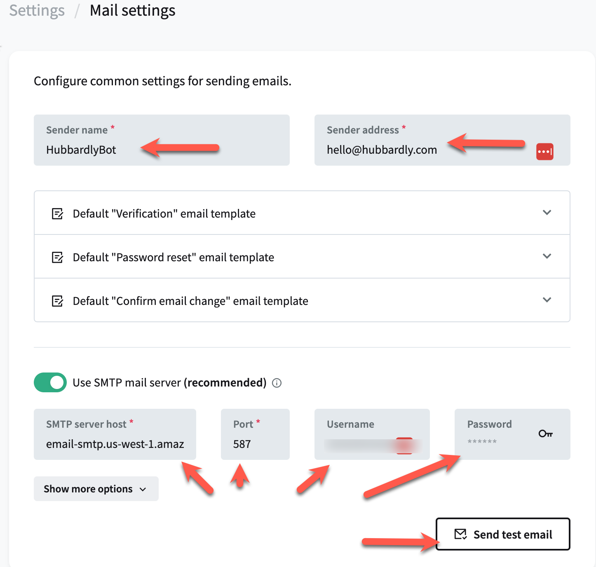
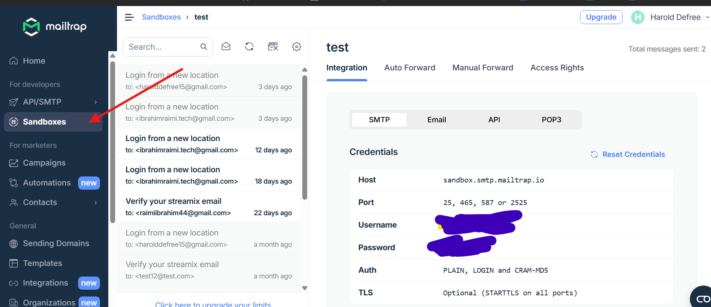

# Outgoing Email in PocketBase

Reliable outgoing email is crucial for many applications, and PocketBase provides flexible options for sending emails. However, ensuring consistent and reliable email delivery can be complex due to factors like spam filters, sender reputation, and email authentication. This guide will help you navigate these challenges and recommend two trusted solutions: **Amazon SES** and **Google Suite**.

## Configuring Outgoing Email in PocketBase

PocketBase includes a **testing feature** to verify that your outgoing email setup is functioning correctly. You can use it to send test emails and ensure that:

- Emails are delivered to the recipient’s inbox.
- The sender’s name and email address are correctly displayed.

### Steps for Testing

1. Configure your outgoing email settings with your chosen service (SES, Google Suite, or another provider).
2. Use PocketBase’s email testing feature to send a test email.
3. Verify that the email is received and that the **From** name and email address are correct.
4. Check if the email landed in the inbox and not the spam folder. If emails are going to spam, review your authentication setup (SPF, DKIM, etc.).

This testing process helps ensure that your outgoing email configuration is working as expected before going live.

## Email Testing with Mailtrap

For testing and development purposes, **Mailtrap** provides an excellent sandbox environment that captures outgoing emails without delivering them to real recipients. This is perfect for testing email functionality during development without the risk of sending test emails to actual users.

### Why Use Mailtrap for Testing?

- **Safe Testing Environment**: All emails are captured in a sandbox, preventing accidental delivery to real users
- **Easy Setup**: Simple SMTP configuration with clear documentation
- **Email Inspection**: View HTML/text versions, headers, and spam score analysis
- **Team Collaboration**: Share inboxes with team members for collaborative testing

### Mailtrap Pricing

Mailtrap offers a generous free tier and scalable paid plans:

| Plan | Price | Emails/Month | Contacts | Best For |
|------|-------|--------------|----------|----------|
| **Free** | $0/forever | 3,500 | 100 | Professionals and companies trying out services |
| **Basic 10K** | $15/month | 10,000 | 5,000 | Startups and small businesses |
| **Business 100K** ⭐ | $85/month | 100,000 | 100,000 | Companies needing higher sending volume |
| **Enterprise 1.5M** | $750/month | 1,500,000 | Unlimited | Large-scale organizations |

The free tier is particularly attractive for development and testing, offering 3,500 emails per month at no cost.

### Setting Up Mailtrap

1. Create a free account at [mailtrap.io](https://mailtrap.io)
2. Navigate to your inbox and copy the SMTP credentials
3. Configure PocketBase with the provided SMTP settings
4. Test your email functionality safely in the sandbox environment

## Recommended Production Services

### Amazon SES

Amazon Simple Email Service (SES) is a powerful and cost-effective email-sending platform. It’s designed for high scalability and reliability, making it a great option for handling transactional emails, password resets, and more. You can follow the setup guide at [Amazon SES](/docs/ses) to integrate it with your PocketBase instance.

### Google Suite

Google Suite (now known as Google Workspace) provides professional email services using your custom domain. It's ideal if you want to ensure that your emails come from a trusted provider while using Google’s secure infrastructure. You can find a step-by-step guide for integration at [Google Suite Email Setup](/docs/gs-gmail).

## Complexity of Reliable Outgoing Email

Sending reliable outgoing email isn’t as simple as just hitting "send." Email deliverability can be affected by:

- **Spam filters**: Emails may be flagged as spam if not properly configured.
- **Authentication**: Implementing DKIM, SPF, and DMARC protocols is essential for ensuring your emails are trusted by recipients.
- **Sender reputation**: Consistent, high-quality email sending helps build a good sender reputation, which is vital for long-term reliability.

Using trusted providers like Amazon SES and Google Suite can help you navigate these complexities by leveraging their expertise in handling email infrastructure.
