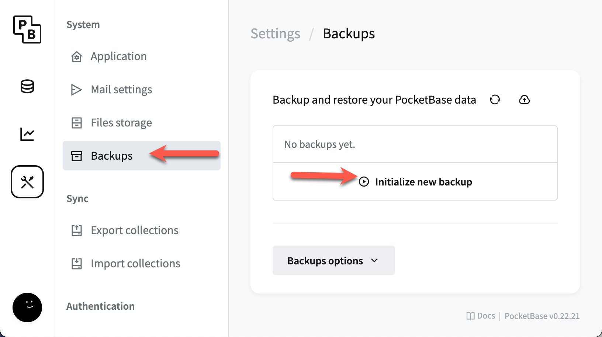
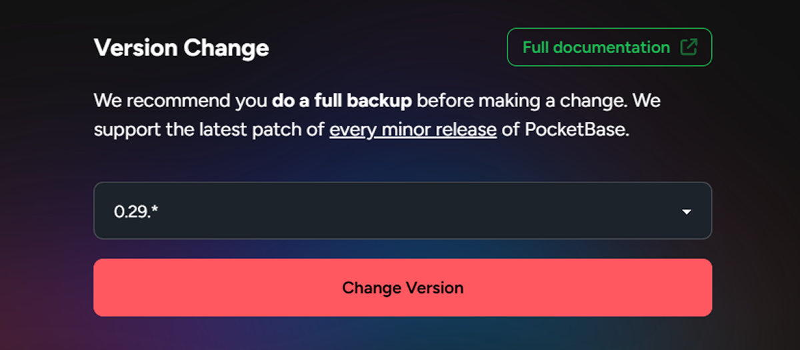

# Changing PocketBase Versions

PocketHost supports the latest minor release of each PocketBase version (e.g., `0.16.*`), and you can update your instance to stay on the latest release. When changing PocketBase versions, whether upgrading or downgrading, it’s important to take precautions to ensure the stability of your instance and the integrity of your data.

## Upgrade Strategy

Upgrading your instance to the latest version of PocketBase is straightforward but requires careful planning to avoid data loss or unexpected behavior. Here’s the recommended approach:

1. [Back up your instance](/docs/backup-restore) to ensure your data is safe.  
   
2. **Create a second instance**: We recommend creating a second PocketHost instance and restoring your backup to it. This allows you to test the upgrade without affecting your live instance.
3. Perform the upgrade on the second instance, ensuring all functionality is intact and working as expected.  
   
4. Once you are confident that everything works correctly, upgrade your main instance.
5. [Power off your instance](/docs/power) to make it live again after the upgrade.

## Automatic Upgrade Steps

For most cases, automatic upgrades are possible by simply switching to the latest version:

1. [Back up your instance](/docs/backup-restore).  
   
2. Change to the latest supported version in the PocketHost dashboard (e.g., `0.16.*`).  
   
3. [Power off your instance](/docs/power) and restart it to apply the changes.

## Manual Upgrade Steps (Rare Cases)

If the automatic upgrade results in an unresponsive instance due to database schema issues, a manual upgrade is required:

1. [Back up your instance](/docs/backup-restore) via the PocketBase admin.
2. Download your database backup from the PocketBase admin.
3. On your local machine, follow the necessary upgrade steps according to the [PocketBase documentation](https://pocketbase.io/docs/).
4. Perform a backup locally after completing the upgrade.
5. [Restore](/docs/backup-restore) the upgraded backup via the live PocketBase admin.

## Important Notes

### Downgrading Versions

**Be cautious when downgrading** – PocketBase does not officially support downgrades. While downgrades may work in some cases, there is no guarantee they will succeed without causing issues. If you attempt to downgrade and run into problems, there is no official resolution path.

### Testing Before Upgrading

To avoid potential disruptions, always create a second instance, restore your backup to it, and test the upgrade there first. This practice ensures you can catch any issues before applying changes to your live instance.

### System Table Migrations

When you upgrade to a new version, PocketBase may perform automatic migrations on system tables. These migrations are typically non-destructive, but you should proceed with caution and ensure you have a backup before applying any updates.
