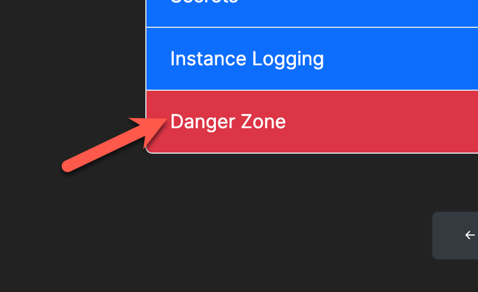
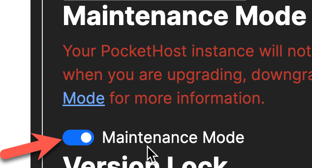

Maintenance Mode will prevent your instances `pocketbase` process from running. No requests are processed while your instance is in Maintenance Mode.

Maintenance mode can be activated manually, or PocketHost may place your instance in maintenance mode if it detects that the instance is malfunctining.

If your `pocketbase` process exits unexpectedly for any reason, PocketHost will place your instance in Maintenance Mode. This automatic action will cause your PocketBase instance to shut down. The `pocketbase` process will exit and no further requests will be processed.

Maintenance Mode is helpful for the following tasks:

- Updating the version [see upgrading](./upgrading.md)
- Backing up your data [see backing up and restoring](./backup-and-restore.md)
- Emergency shutdown for any other reason you choose.

## Manually Activating Maintenance Mode

To activate Maintenance Mode, navigate to your instance dashboard and head for the Danger Zone.

<figure><figcaption>
Danger Zone
</figcaption></figure>

Then, switch the instance to Maintenance Mode.

<figure><figcaption>
Maintenance Mode
</figcaption></figure>

##
