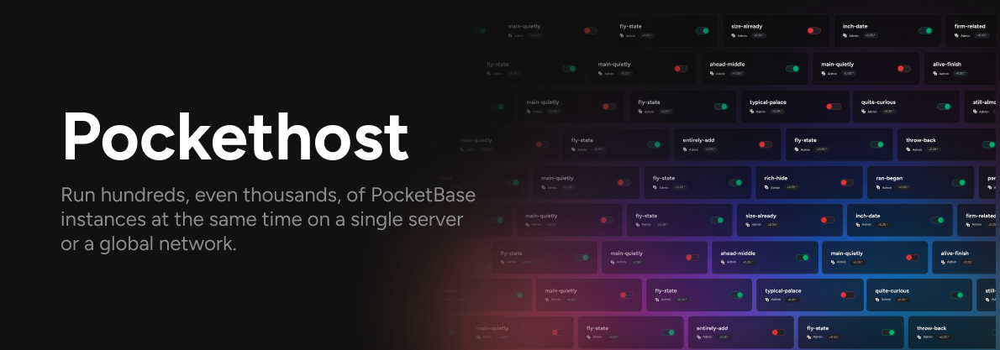

# Pockethost

**PocketHost** is a **multi-user, multi-tenant hosting platform** for [PocketBase](https://pocketbase.io).  
With PocketHost, you can run **hundreds or even thousands of PocketBase instances** on a single server or across a global edge network.

### Features:

- 🚀 **Unlimited instances** – spin up as many PocketBase instances as you need  
- 🌐 **Per-instance subdomains** – each instance is isolated and accessible at its own subdomain  
- 🔒 **Secure by default** – runs in Docker with automatic SSL certificates  
- 🎯 **Custom domain support** – connect your own domain via CNAME  

## Quickstart

`npx pockethost serve`

## Scaling Up

### `pockethost firewall`

### `pockethost mothership`

### `pockethost edge:daemon`

### `pockethost edge:syslog`

### `pockethost edge:ftp`

## Other commands

### `pockethost download`

### `pockethost health`

## Support

💬 Join our [Discord community](https://discord.gg/nVTxCMEcGT).

📖 [Documentation](https://pockethost.io/docs)

### Sponsored by [pockethost.io](https://pockethost.io) – Instantly host your PocketBase projects 