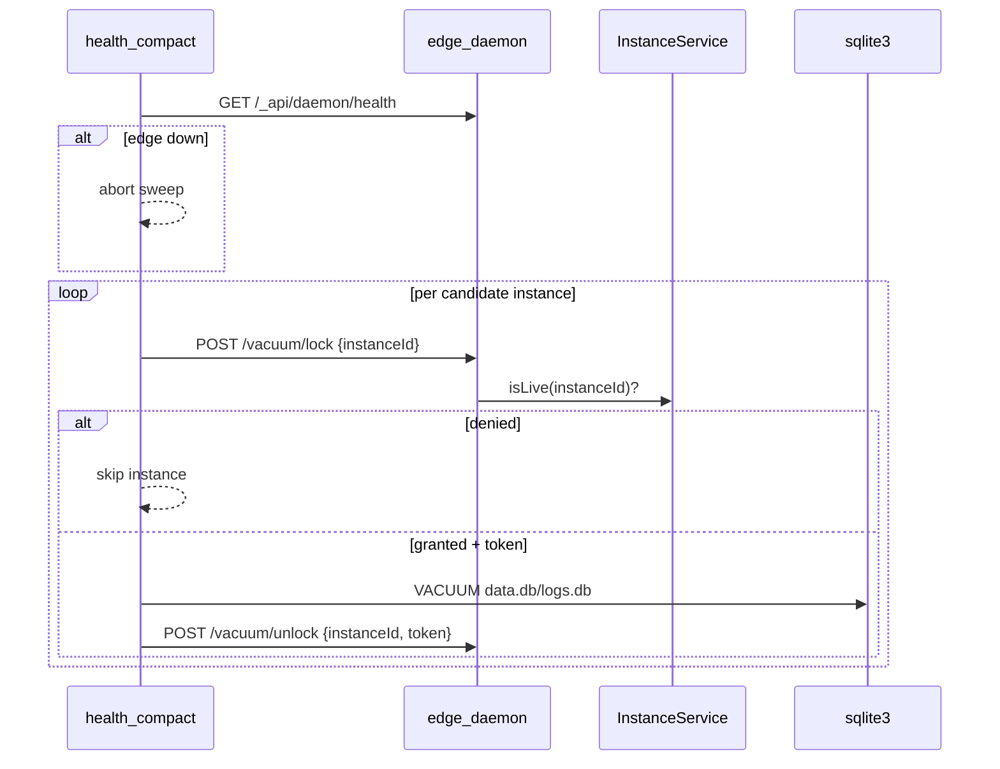

# Edge vacuum locks + incremental compact

## Problem

[`vacuum.ts`](packages/pockethost/src/cli/commands/HealthCommand/vacuum.ts) runs as a separate PM2 process and detects "running" via a one-shot `docker ps` snapshot. Edge spawns live in `instanceApis` (including in-flight **Starting** state) and is not consulted. That leaves TOCTOU races between compact and [`InstanceService`](packages/pockethost/src/services/InstanceService/index.ts).

## Architecture



Edge is the mutex owner. Compact is a client. Mothership stays in the loop only for `autoVacuum` opt-out (unchanged).

## 1. `VacuumLockService` (new)

**File:** [`packages/pockethost/src/services/VacuumLockService/index.ts`](packages/pockethost/src/services/VacuumLockService/index.ts)

Singleton (`mkSingleton`) holding:

- `locks: Map<instanceId, { token, acquiredAt }>`
- `isLive: (id) => boolean` callback (default `() => true` until registered — conservative)
- `LOCK_TTL_MS` (e.g. 30 min) sweeper via `setInterval`, clears stale locks

**Grant rules** (all must pass):

1. Not already locked
2. `!isLive(instanceId)` (covers Starting + Running in `instanceApis`)
3. Not in docker mount set (reuse logic from [`getRunningInstanceIds`](packages/pockethost/src/cli/commands/HealthCommand/vacuum.ts), move shared helper to a small util or import from vacuum module)

**Routes** mounted via `(await proxyService()).use('/_api/daemon/vacuum', router)` (same pattern as [`RealtimeLog.ts`](packages/pockethost/src/services/RealtimeLog.ts)):

| Method | Path      | Body                                 | Response                                                                 |
| ------ | --------- | ------------------------------------ | ------------------------------------------------------------------------ |
| `POST` | `/lock`   | `{ instanceIds: string[] }`          | `{ granted: [{ instanceId, token }], denied: [{ instanceId, reason }] }` |
| `POST` | `/unlock` | `{ locks: [{ instanceId, token }] }` | `{ released: string[], failed: string[] }`                               |

**Auth:** `x-pockethost-secret` header must match `process.env.PH_SECRET` (same as [`firewall/cidr.ts`](packages/pockethost/src/cli/commands/FirewallCommand/ServeCommand/firewall/cidr.ts)). Reject with 401 if missing/wrong.

**Startup:** clear all locks on service init (edge restart = safe reset).

Export from [`services/index.ts`](packages/pockethost/src/services/index.ts).

## 2. Wire into edge daemon

**[`daemon.ts`](packages/pockethost/src/cli/commands/EdgeCommand/DaemonCommand/ServeCommand/daemon.ts):**

```typescript
await instanceService({ ... })
await VacuumLockService({ logger })
```

**[`InstanceService/index.ts`](packages/pockethost/src/services/InstanceService/index.ts):**

- After `instanceApis` is in scope, call `vacuumLocks.registerIsLive((id) => Boolean(instanceApis[id]))`
- Before `createInstanceApi` (around line 357), check `vacuumLocks.isLocked(instance.id)` and throw `userError` with a short maintenance message

This closes the spawn path edge owns.

## 3. Compact client + vacuum flow

**New helper:** `packages/pockethost/src/cli/commands/HealthCommand/edgeVacuumClient.ts`

- `assertEdgeReady()` — `GET http://127.0.0.1:${DAEMON_PORT()}/_api/daemon/health`, throw/abort if unreachable
- `lockInstance(id)` / `unlockInstance(id, token)` — POST to `/_api/daemon/vacuum/*` with `x-pockethost-secret: PH_SECRET`
- Use `mkInternalUrl(DAEMON_PORT())` from [`core/internal.ts`](packages/pockethost/src/core/internal.ts)

**Refactor [`vacuumIdleInstanceDbs`](packages/pockethost/src/cli/commands/HealthCommand/vacuum.ts):**

1. Preflight: `assertEdgeReady()` — if fail, warn + return empty (no instance vacuum, no Discord success for instances)
2. Group `dbPaths` by `instanceId` (vacuum both dbs under one lock)
3. Per instance (after existing `fleetIds` / `autoVacuum` / `--hours-back` filters):
   - `lock` → if denied, log + skip
   - `try/finally` → vacuum `data.db` + `logs.db` → `unlock` always
4. Remove reliance on fleet-wide `getRunningInstanceIds()` snapshot for correctness (keep docker helper for VacuumLockService grant only)
5. Optional defense-in-depth: re-check docker for that instance immediately before `sqlite3` (if grant succeeded but somehow container appeared, skip vacuum)

**[`--hours-back`](packages/pockethost/src/cli/commands/HealthCommand/index.ts):**

- Add `.option('--hours-back <hours>', 'Only vacuum instances with db mtime within N hours')` to `health compact`
- Pass through `compact` → `vacuumAll` → `vacuumIdleInstanceDbs`
- Filter: include instance if `max(mtime(data.db), mtime(logs.db)) >= now - hours * 3600_000`
- Omit flag = full sweep (current behavior)

**Mothership vacuum** ([`vacuumMothershipDbs`](packages/pockethost/src/cli/commands/HealthCommand/vacuum.ts)): unchanged (PM2 stop window). Still runs after instance sweep. If edge preflight fails, skip instance vacuum only — mothership vacuum can still proceed (or gate entire `vacuumAll` on edge for simplicity; recommend gating **instance** sweep only so mothership compaction is not blocked by edge outage).

## 4. Ops + docs

- [`ecosystem.config.cjs`](ecosystem.config.cjs): `health-compact` script → `pnpm prod:cli health compact --hours-back=24`
- [`MEMORY.md`](MEMORY.md): update `health compact` row (edge lock API, `--hours-back`, spawn gate)
- [`packages/dashboard/src/routes/(static)/docs/auto-vacuum/+page.md`](<packages/dashboard/src/routes/(static)/docs/auto-vacuum/+page.md>): note brief maintenance if request hits a locked instance during sweep
- [`backlog.md`](backlog.md): add Backlog row for shipped work (move to Done on merge)

**Firewall rate limiter:** extend [`isHealthProbePath`](packages/pockethost/src/cli/commands/FirewallCommand/ServeCommand/firewall/rate-limiter.ts) to include `/_api/daemon/vacuum/*` (defensive; compact calls localhost directly).

## 5. Failure modes (explicit behavior)

| Scenario                            | Behavior                                                           |
| ----------------------------------- | ------------------------------------------------------------------ |
| Edge down at sweep start            | Abort instance vacuum; log + Discord reflects 0 instances vacuumed |
| Lock denied (live/spawning)         | Skip instance, continue sweep                                      |
| Vacuum sqlite error                 | Log, unlock in `finally`, continue                                 |
| Compact process killed mid-instance | Edge TTL clears lock after 30 min                                  |
| Edge restarts mid-sweep             | Locks cleared on VacuumLockService init                            |
| User request during lock            | `userError` maintenance message, no spawn                          |

No mothership `power`/`suspension`/`maintenance` field changes.

## Key files

| File                                  | Change                                  |
| ------------------------------------- | --------------------------------------- |
| `services/VacuumLockService/index.ts` | New lock service + routes               |
| `services/InstanceService/index.ts`   | `registerIsLive` + spawn gate           |
| `cli/.../daemon.ts`                   | Init VacuumLockService                  |
| `cli/.../edgeVacuumClient.ts`         | Compact HTTP client                     |
| `cli/.../vacuum.ts`                   | Lock acquire/release loop, mtime filter |
| `cli/.../HealthCommand/index.ts`      | `--hours-back` option                   |
| `ecosystem.config.cjs`                | Nightly `--hours-back=24`               |

## Out of scope

- Unit tests (none exist for vacuum today)
- Blog post (internal safety + incremental sweep; docs tweak only)
- `integrity_check` on vacuum failure (nice follow-up)
